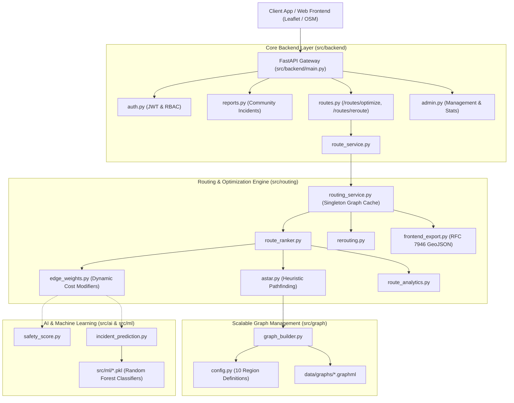

# Raksha-Path (AI-Rakshak)
### AI-Powered Intelligent Route Optimization & Community Safety Platform

**Smart India Hackathon (SIH 2026)**  
A unified, production-grade geospatial routing, hazard prediction, and community safety platform built for multi-region scalability across India.

---

## 📌 Table of Contents
1. [Project Overview](#-project-overview)
2. [Key Features](#-key-features)
3. [System Architecture](#-system-architecture)
4. [Consolidated Project Structure](#-consolidated-project-structure)
5. [Installation & Setup](#-installation--setup)
   - [Linux / macOS Setup](#linux--macos-setup)
   - [Windows Setup](#windows-setup)
6. [Running the Project](#-running-the-project)
7. [Running Tests & Benchmarks](#-running-tests--benchmarks)
8. [API Endpoints Reference](#-api-endpoints-reference)
9. [Team Member Responsibilities](#-team-member-responsibilities)
10. [Future Scope](#-future-scope)

---

## 🚀 Project Overview

**Raksha-Path** is an intelligent navigation and community safety platform designed to provide multi-objective routing that prioritizes commuter safety, flood resilience, accident avoidance, and dynamic hazard rerouting. Unlike traditional navigation engines that only optimize for travel time or distance, Raksha-Path integrates live machine learning risk predictions, community-reported incident verification, and dynamic edge-weighted pathfinding over real-world OpenStreetMap road networks.

---

## ✨ Key Features

- **Multi-Objective Graph Routing**: A* and Dijkstra pathfinding with dynamic edge weighting supporting **Fastest**, **Safest**, and **Balanced** route profiles.
- **Dynamic In-Transit Rerouting**: Automatic detection of emerging route hazards (floods, accidents, congestion) and cost-threshold-triggered alternative route computation.
- **Multi-Region Scalability**: Support for 10 initial regions (Bhubaneswar, Assam, Meghalaya, Arunachal Pradesh, Nagaland, Manipur, Mizoram, Tripura, Sikkim, and North-East Combined) with automatic caching and Lazy Graph Loading.
- **AI Hazard Prediction Models**: Trained Random Forest classifiers for flood probability, traffic congestion forecasting, and accident likelihood.
- **Community Incident Verification**: Automated heuristic and reputation-weighted verification for user-reported road incidents.
- **Frontend Map Compatibility**: Direct RFC 7946 GeoJSON LineString and Leaflet/OSM polyline formatting with styled feature collections.
- **Enterprise REST API**: FastAPI backend with JWT authentication, PostGIS spatial queries, and admin dashboard statistics.

---

## 🏛 System Architecture



---

## 📁 Consolidated Project Structure

```
sih-2026-airakshak/
├── src/
│   ├── backend/               # FastAPI backend & database layer
│   │   ├── admin.py           # Admin management endpoints
│   │   ├── auth.py            # JWT authentication & password hashing
│   │   ├── database.py        # SQLAlchemy session & engine configuration
│   │   ├── main.py            # FastAPI application entrypoint & routers
│   │   ├── models.py          # SQLAlchemy / PostGIS database models
│   │   ├── notifications.py   # User safety alerts & notifications
│   │   ├── reports.py         # Community safety incident reporting
│   │   ├── routes.py          # Route optimization & rerouting endpoints
│   │   ├── route_service.py   # Bridge between backend and routing engine
│   │   └── schemas.py         # Pydantic validation schemas
│   │
│   ├── routing/               # Graph algorithms & pathfinding engine
│   │   ├── astar.py           # Optimized A* pathfinding algorithm
│   │   ├── dijkstra.py        # Dijkstra algorithm implementation
│   │   ├── edge_weights.py    # Dynamic AI weight modifier cost functions
│   │   ├── frontend_export.py # GeoJSON RFC 7946 & Leaflet polyline exporter
│   │   ├── rerouting.py       # Dynamic in-transit rerouting engine
│   │   ├── route_analytics.py # Distance, travel time & safety analytics
│   │   ├── route_ranker.py    # Multi-profile route ranking (Fastest/Safest/Balanced)
│   │   └── routing_service.py # Lazy graph caching & unified routing API
│   │
│   ├── graph/                 # Graph management & region configurations
│   │   ├── config.py          # 10 Region definitions & GraphML paths
│   │   ├── graph_builder.py   # OSMnx auto-downloading & cache loader
│   │   └── graph_validator.py # Road graph topology validation utilities
│   │
│   ├── ai/                    # Intelligence & scoring engine
│   │   ├── accident_prediction.py
│   │   ├── confidence_engine.py
│   │   ├── congestion_prediction.py
│   │   ├── demo_end_to_end.py
│   │   ├── explainable_ai.py
│   │   ├── flood_prediction.py
│   │   ├── incident_prediction.py
│   │   ├── report_verification.py
│   │   ├── retraining.py
│   │   └── safety_score.py
│   │
│   ├── ml/                    # Trained models & datasets
│   │   ├── accident_model.pkl
│   │   ├── congestion_model.pkl
│   │   ├── flood_model.pkl
│   │   ├── evaluation.py
│   │   ├── predict.py
│   │   ├── train.py
│   │   └── datasets/          # Training datasets & generator
│   │
│   └── tests/                 # Comprehensive test suite (24 unit & integration tests)
│       ├── test_astar.py
│       ├── test_backend_integration.py
│       ├── test_benchmarks.py
│       ├── test_edge_weights.py
│       ├── test_frontend_export.py
│       ├── test_graph_builder.py
│       ├── test_rerouting.py
│       ├── test_route_analytics.py
│       └── test_routing_service.py
│
├── frontend/                  # React + TypeScript + Vite + Tailwind CSS Frontend
│   ├── src/
│   │   ├── components/        # MapView, RoutePlanningPanel, LiveNavigationHUD, Modals
│   │   ├── pages/             # HomePage, SafetyPage, ProfilePage
│   │   ├── services/          # Real API client connecting to backend endpoints
│   │   └── types/             # TypeScript type definitions for GeoJSON & routes
│   ├── index.html             # Obsidian glassmorphism & Leaflet CSS entry
│   └── package.json
│
├── data/
│   └── graphs/                # Cached GraphML network files
├── cache/                     # OSMnx request cache
├── .env                       # Environment variables (DB URL, secret keys)
├── .gitignore                 # Standard Git exclusion rules
├── pytest.ini                 # Pytest pythonpath configuration
├── requirements.txt           # Pinned production dependencies
└── run.py                     # Unified CLI & server launcher
```

---

## ⚙️ Installation & Setup

### Prerequisites
- Python 3.10+ (Python 3.13 recommended)
- Node.js 18+ & npm
- PostgreSQL with PostGIS extension (optional for pure routing/AI demo mode)

### Linux / macOS Setup

```bash
# 1. Clone the repository
git clone https://github.com/your-org/sih-2026-airakshak.git
cd sih-2026-airakshak

# 2. Create and activate virtual environment
python3 -m venv venv
source venv/bin/activate

# 3. Install backend dependencies
pip install -r requirements.txt

# 4. Install frontend dependencies
cd frontend && npm install && cd ..
```

### Windows Setup

```cmd
:: 1. Clone repository and navigate
git clone https://github.com/your-org/sih-2026-airakshak.git
cd sih-2026-airakshak

:: 2. Create and activate virtual environment
python -m venv venv
venv\Scripts\activate

:: 3. Install backend dependencies
pip install -r requirements.txt

:: 4. Install frontend dependencies
cd frontend && npm install && cd ..
```

---

## 🚦 Running the Project

The unified `run.py` script provides a single entry point for all subsystems:

### 1. Start the FastAPI Backend Server
```bash
# Development mode with hot-reload
python run.py backend --reload
```
* API Base: `http://localhost:8000`
* Interactive Docs: `http://localhost:8000/docs`

### 2. Start the React/Vite Frontend Application
```bash
python run.py frontend
```
* Web Application UI: `http://localhost:3000`

### 3. Run the Multi-Region Graph CLI
```bash
# Download and validate default region (Bhubaneswar)
python run.py graph

# Load and validate a specific North-East state
PYTHONPATH=src python -m graph --region assam
```

### 4. Run the End-to-End AI Pipeline Demo
```bash
python run.py demo
```

---

## 🧪 Running Tests & Benchmarks

Run the complete automated test suite (24 passing unit and integration tests):

```bash
# Run all tests
pytest -v

# Run with benchmark comparisons (A* vs Dijkstra efficiency)
pytest -v src/tests/test_benchmarks.py
```

---

## 📡 API Endpoints Reference

| Method | Endpoint | Description |
| :--- | :--- | :--- |
| `POST` | `/routes/optimize` | Computes ranked routes (Fastest, Safest, Balanced) with GeoJSON & analytics |
| `POST` | `/routes/reroute` | Evaluates dynamic hazards and computes an alternative path if threshold exceeded |
| `POST` | `/auth/register` | Register a new user |
| `POST` | `/auth/login` | Authenticate user and retrieve JWT bearer token |
| `GET` | `/auth/me` | Retrieve profile of authenticated user |
| `POST` | `/reports/` | Submit a new safety / hazard incident report |
| `GET` | `/reports/` | List all reported safety incidents |
| `GET` | `/reports/nearby` | Query spatial hazards within radius of GPS coordinates |
| `GET` | `/admin/statistics` | Retrieve system-wide incident and resolution metrics |

---

## 👥 Team Member Responsibilities

- **Member 1 (Frontend & Maps)**: React, Leaflet/OSM map rendering, GeoJSON visualization, turn-by-turn UI.
- **Member 2 (Backend & Database)**: FastAPI REST API, PostgreSQL/PostGIS database, authentication, report schemas.
- **Member 3 (Routing & Optimization)**: A* / Dijkstra engine, dynamic edge weights, in-transit rerouting, graph management, GeoJSON exporter.
- **Member 4 (AI & Intelligence)**: Hazard forecasting (Flood, Congestion, Accident ML models), confidence reconciliation, incident verification.

---

## 🔮 Future Scope

1. **Nationwide Graph Partitioning**: Hierarchical contraction hierarchies (CH) for sub-second pan-India routing.
2. **Real-time IoT Telemetry**: Integration with municipal water level sensors and traffic cameras for automated edge weight penalties.
3. **Offline Emergency Navigation**: Edge-compiled graph routing on mobile clients during network blackouts.
